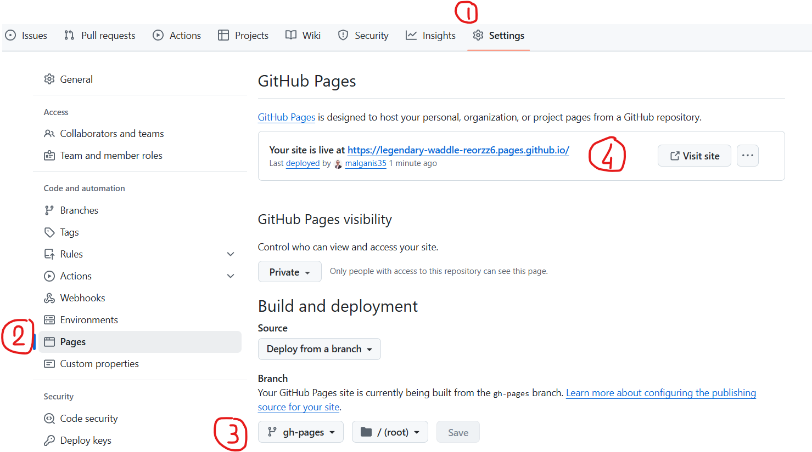

# Cao Tri DO Marvelous MLOps Training Documentation

[](https://www.keyrus.com)
[](https://www.keyrus.com)
[](https://www.keyrus.com)


## Description

Project documentation

Sphinx documentation using GitLab / Github Pages, containing a quick starting tutorial on Sphinx to learn the main commands.

Learn more about GitLab Pages at https://about.gitlab.com/product/pages/ and the official
documentation https://docs.gitlab.com/ee/user/project/pages/.

## Main commands to remember

- ``git clone [GIT_URL]``: Clone the project and replace [GIT_URL] with the URL of your repository

- ``make dev_install``: Install the requirements

- ``make livehtml``: Local live preview

- ``make clean``: Clean the \_build folder

- ``make simplepdf_build``: PDF Build with SimplePDF

## Deploy to Gitlab and Github Pages

### Gitlab Pages

We provide a CI/CD for Gitlab. The CI/CD will be automatically triggerd and deploy on Gitlab Pages. URL of the generated documentation can be found: **Deploy** >> **Pages**

### Github Pages

For Github Pages, you will need to configure some parameters to deploy the documentation:

- Go to **Settings** >> **Pages**

- In **Build and Deployment** section, select **Deploy from a branch**

- In the **Branch** section, select **gh-pages** on **/root**

- Wait a few minutes for the CI/CD to activate. You should normally see a link for your online documentation

- Note: You can add your custom domain to have a more user friendly URL



## Installation

We recommend to use ``pyenv`` for this project. If you do not have ``pyenv``, you can follow the instruction by using:

```
make help_setup
```

Alternatively, you can also use ``conda`` or ``venv``. You can check what is available for your system, by using:

```
make test_environment
```

## Usage / Building locally

You can automatically build your sphinx documentation and live preview with sphinx-autobuild: ``make livehtml``

The generated HTML will be located in the location specified by ``conf.py``,
in this case ``_build/html``.

If you need to clean the ``_build/`` folder, you can use the command ``make clean``

This template is automatically configure to your Gitlab Pages CI/CD. To view your Gitlab Pages, go to **Deploy** --> **Pages**. You will see the link of the website on the internet

## Adapt this template to your project

To adapt this template to your project, here are some of the configurations you will need to do:

- ``conf.py``: project = 'Sphinx Template Website'
- ``conf.py``: copyright = f'{date.today().year}, Keyrus FR DS Team'
- ``conf.py``: author = 'Keyrus FR DS Team'
- ``conf.py``: language = 'en'
- ``conf.py``: html_theme = 'furo' --> A great theme for book is sphinx-book-theme
- ``conf.py``: favicons = [{"href": "logo_keyrus-favicon.png"},] --> Add your favicon to the ``_static/`` folder and change here your logo filename
- ``index.rst``: change / delete the banner in the index located in ``docs/``


## Support
For more information, do not hesitate to contact me: cao-tri.do@keyrus.com

## Roadmap
Some underdeveloppment ideas:

- Add a support for writing a book using this template
- Adapt the CI/CD to deploy on Azure Static Web App

## Contributing
State if you are open to contributions and what your requirements are for accepting them.

## Did you fork this project?
If you forked this project for your own use, please go to your project's
**Settings** and remove the forking relationship, which won't be necessary
unless you want to contribute back to the upstream project.

## Troubleshooting
No issues reported yet.
